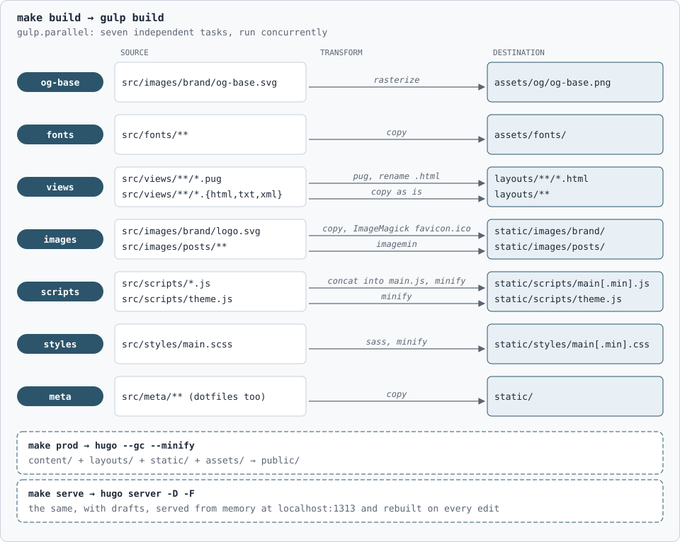

This blog is a static website built with [Hugo](https://gohugo.io/) on a theme I wrote myself. 
Everything lives in [this GitHub repo](https://github.com/gmarciani/gmarciani.github.io). 

The UI is intentionally minimalist. The content is the product here, and no fancy element should compete with it.

## Why a static website

A blog has no sales to lose, but it has readers, and a slow page loses them before the first paragraph. 
A [CMS](https://en.wikipedia.org/wiki/Content_management_system), such as [WordPress](https://wordpress.org/), is a common choice for blogs, but puts a runtime, a database, and a plugin ecosystem between the reader and the page. 
Those elements cost something on each web request, such as the time to render the page, or in maintenance, such as a backend to patch or an attack surface to protect. 
A static site pays those costs once, at build time, and then serves files; so there is nothing to break in production and nothing to break into. 
Google's [Why speed matters](https://web.dev/learn/performance/why-speed-matters) is an interesting reading on this topic.

Speed has to be measured, not assumed, and Yoast's [How to check site speed](https://yoast.com/how-to-check-site-speed/) explains the tools to do it. 
One of those is [PageSpeed](https://pagespeed.web.dev/analysis), where the blog scores 100% on desktop and 92% on mobile, with a total blocking time under 40ms.
## Project structure


%1{content}  %2{theme}  %3{build system}  %4{generated}

├── %3{config.yaml}                           Hugo configuration: site params, taxonomies, output formats
├── %1{content/}                              Markdown: the about page and the posts
│   └── %1{posts/}
│       └── %1{Category1/}                    a category
│           ├── %1{_index.md}                 its title and taxonomy
│           ├── %1{PostTitle1.md}             a post without assets
│           └── %1{PostTitle2/}               a post with assets, as a page bundle
│               ├── %1{index.md}              the post
│               ├── %1{images/}               figures, referenced as images/Image1.svg
│               └── %1{code/}                 source files, rendered with post-code
├── %1{archetypes/}                           front matter template for new posts
├── %2{src/}                                  theme source, compiled by Gulp
│   ├── %2{views/}                            Pug templates, custom shortcodes, SEO partial
│   ├── %2{styles/}                           SCSS
│   ├── %2{scripts/}                          client-side JavaScript
│   ├── %2{images/}                           brand assets, social image canvas, post images
│   ├── %2{meta/}                             robots.txt, web manifest, browser config
│   └── %2{fonts/}                            fonts for the social images
├── %3{gulpfile.js}                           stage one of the build
├── %3{Makefile}                              the entry points: build, serve, prod
├── %3{.github/}                              deploy workflow and pull request template
├── %3{.pre-commit-config.yaml}               pre-commit hooks: whitespace, YAML, file size
├── %4{layouts/}                              generated from src/views, gitignored
├── %4{static/}                               generated from src/, gitignored
├── %4{assets/}                               generated from src/fonts and src/images, gitignored
└── %4{public/}                               the built site, gitignored


The generated directories are gitignored and never edited by hand. 
A post is a single Markdown file, or a page bundle when it ships its own files; Hugo publishes those under the post's URL, which is the same in both forms. 
Hugo serves `static/` verbatim and treats `assets/` as inputs to its own pipeline, in this case the fonts and the canvas for the social images; Gulp fills both.
The [Hugo documentation](https://gohugo.io/getting-started/directory-structure/) describes what each of these directories means to Hugo.

## The build pipeline

The build has two stages.

First, **[Gulp](https://gulpjs.com/)** turns the theme source under `src/` into the files Hugo expects. The [Pug](https://pugjs.org/) partials become the HTML layouts, the [SCSS](https://sass-lang.com/) partials become the minified stylesheet, images and scripts are optimized and copied over.

Then, **Hugo** combines the Markdown under `content/` with those layouts and assets into the final site. It also generates a social preview image per post by overlaying the title on the brand canvas, an SVG under `src/images/brand/` that Gulp rasterizes, so no post needs a hand-made one.



Every page carries its own metadata: canonical URL, [Open Graph](https://ogp.me/) and [X cards](http://web.archive.org/web/20240515174221/https://developer.twitter.com/en/docs/twitter-for-websites/cards/overview/abouts-cards), and [schema.org](https://schema.org/) structured data as [JSON-LD](https://json-ld.org/), all derived from the front matter. 
The site also publishes an [`llms.txt`](/llms.txt) index, following the [llms.txt proposal](https://llmstxt.org/), so an AI agent gets a map of the content without crawling it.

## Deployment

The site is hosted on [GitHub Pages](https://pages.github.com/) as a user site: the repository is named `gmarciani.github.io`, so GitHub serves it at the root of that domain with its own TLS certificate.

Every push to `main` triggers the [deploy workflow](https://github.com/gmarciani/gmarciani.github.io/blob/main/.github/workflows/deploy.yaml), that builds the website for production and publishes it.

Two incidents are possible. 
(i) A failed build never reaches production, so readers keep seeing the previous site. In this case, the deployment workflow would be simply retried, as it is idempotent.
(ii) An unexpected publication does reach them. In this case, pushing a reverting commit would solve.

## Licensing

Code and content are released under different licenses, because the intent differs: permissive on code, copyleft on prose. 

The theme and build pipeline are software, released under the [MIT license](https://github.com/gmarciani/gmarciani.github.io/blob/main/LICENSE) so that anyone can fork the repository, delete `content/`, and have a working blog. 

The posts need a different license because they are not code, but personal opinions I want to be quoted, translated, and built upon with attribution, but not sold, and I want derivatives to stay open. 
[Creative Commons BY-NC-SA 4.0](https://creativecommons.org/licenses/by-nc-sa/4.0/) is written for creative works, says exactly those three things, attribution, non-commercial, share-alike, and is what publishers and translators recognize on sight.

## Custom shortcodes

A [shortcode](https://gohugo.io/content-management/shortcodes/) is a template you call from Markdown, for anything Markdown cannot express on its own. 
Hugo provides some built-in shortcodes for standard embeds, such as YouTube videos or Instagram posts. My theme adds six of its own:
- [`math`](https://github.com/gmarciani/gmarciani.github.io/blob/main/src/views/shortcodes/math.html) typesets a formula with [MathJax](https://www.mathjax.org/). Using it is also what makes a page load MathJax: pages without formulas never fetch it.
- [`epigraph`](https://github.com/gmarciani/gmarciani.github.io/blob/main/src/views/shortcodes/epigraph.html) sets an opening quotation: centered, italic, muted.
- [`filetree`](https://github.com/gmarciani/gmarciani.github.io/blob/main/src/views/shortcodes/filetree.html) prints a directory tree as a code block with two things a fenced code block cannot carry: bold and colored entries.
- [`post-code`](https://github.com/gmarciani/gmarciani.github.io/blob/main/src/views/shortcodes/post-code.html) renders a source file that ships with the post, from the `code/` folder of its page bundle, with highlighting and a download link.
- [`ghcode`](https://github.com/gmarciani/gmarciani.github.io/blob/main/src/views/shortcodes/ghcode.html) fetches a source file from GitHub at build time and renders it with syntax highlighting. The embed is a snapshot taken at build time.
- [`ghactivity`](https://github.com/gmarciani/gmarciani.github.io/blob/main/src/views/shortcodes/ghactivity.html) renders a GitHub contribution chart for a username. It is a link to the profile wrapping an image served by [ghchart](https://ghchart.rshah.org/).


## Appendix: What Hugo renders

What follows is a live showcase of embeds and shortcodes supported by the blog them.
When I modify my shortcodes, I use this age to validate the outcome.

### Links

Cross-references use Hugo's `ref` shortcode, validated at build time: [Hello World]().

### Formulas

Formulas render in the browser with [MathJax](https://www.mathjax.org/):

\int_{a}^{b} x^2 dx

### Figures


Unlike `ref`, Markdown image links aren't validated at build time; a broken one shows the browser's missing-image state instead of failing the build, as below:


### YouTube



### Instagram



### X



### Code Blocks

```java
public static void main(String[] args) {
    System.out.println("Hello world!");
}
```

### Shortcode: epigraph


"Simplicity is prerequisite for reliability."

Edsger W. Dijkstra


### Shortcode: filetree

The `filetree` shortcode, with bold and colored entries:


├── **index.md**          %1{the post}
├── images/
│   └── Image1.svg        %2{a figure}
└── code/
    └── Snippet1.py       %3{a snippet}


### Shortcode: post-code



### Shortcode: ghcode



### Shortcode: ghactivity


